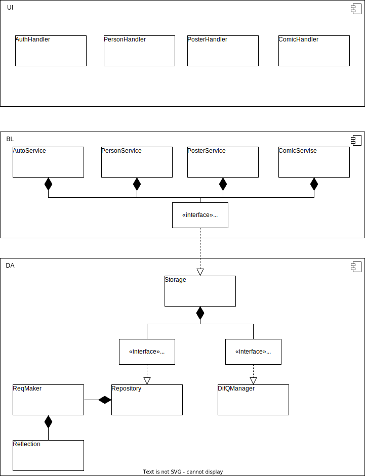

# RUSH Stand Up Club

## Цель работы
Автомотизация работы Stand Up клуба.

Проект представляет из себя сайт, на котором будут размещаться описания мероприятий и их расписание. Также будет раздел с описанием комиков клуба. Это все будет доступно неавторизованному пользователю. К авторизованному пользователю добавится возможность записи на мероприятие и ее отмены, и просмотр истории мероприятий на которые он был записан. 
А админ в свою очередь сможет добавлять, удалять, изменять и просматривать мероприятия, комиков и авторизованных пользователей. 

## Краткий перечень функциональных требований

- Пользователь должен иметь возможность войти в систему, используя свое имя пользователя и пароль
- Пользователь должен иметь возможность зарегистрироваться в системе,
через имя пользователя, почту и логин
- Авторизованный пользователь должен иметь возможность записи на мероприятие, если места еще есть
- Администратор должен иметь возможность редактирования (добавление/изменение/удаление) информации о комиках и мероприятиях

## Use-case диаграмма системы

Существует три типа роли:

- гость (guest)

- авторизованный пользователь (authUser)

- админестратор (admin)

 [## BPMN диаграмма основных бизнес-процессов]:#

## Примеры описания основных пользовательских сценариев

- гость
	+ посмотреть информацию о мероприятие
		- зайти на сайт
		- нажать на кнопку мероприятия
		- нажать на конкретное мероприятие
	+ посмотреть информацию о комике
		- зайти на сайт
		- нажать на кнопку комики
		- нажать на конкретного комика
	+ войти в систему
		- зайти на сайт
		- нажать кнопку войти
		- ввести логин и пароль
		- нажать кнопку войти
	+ зарегистрироваться в системе
		- зайти на сайт
		- нажать кнопку войти
		- нажать кнопку зарегистрироваться
		- ввести свои данные логин, почта и пароль
		- нажать кнопку зарегистрироваться

- авторизованный пользователь
	+ выйти
		- нажать на кнопку выйти
	+ посмотреть информацию о мероприятие
		- зайти на сайт
		- нажать на кнопку мероприятия
		- нажать на конкретное мероприятие
	+ посмотреть информацию о комике
		- зайти на сайт
		- нажать на кнопку комики
		- нажать на конкретного комика
	+ зарегистрироваться на мероприятие
		- зайти на сайт 
		- нажать на кнопку мероприятия
		- нажать кнопку зарегистрироваться
	+ поставить кек комику
		- зайти на сайт
		- нажать на кнопку комики
		- нажать на конкретного комика
		- нажать кнопку КЕК

- администратор
	+ выйти
		- нажать на кнопку выйти
	+ посмотреть информацию о мероприятие
		- зайти на сайт
		- нажать на кнопку мероприятия
		- нажать на конкретное мероприятие
	+ добавить мероприятие
		- зайти на сайт
		- нажать кнопку мероприятия
		- нажать кнопку добавить мероприятие
		- ввести данные 
		- нажать кнопку добавить
	+ изменить мероприятие
		- зайти на сайт
		- нажать на кнопку мероприятия
		- нажать на конкретное мероприятие
		- изменить данные о мероприятии
		- нажать кнопку сохранить
	+ удалить мероприятие
		- зайти на сайт
		- нажать на кнопку мероприятия
		- нажать на конкретное мероприятие
		- нажать кнопку удалить

	+ посмотреть информацию о комике
		- зайти на сайт
		- нажать на кнопку комики
		- нажать на конкретного комика
	+ добавить комика
		- зайти на сайт
		- нажать кнопку комики
		- нажать кнопку добавить комика
		- ввести данные 
		- нажать кнопку добавить
	+ изменить комика
		- зайти на сайт
		- нажать на кнопку комики
		- нажать на конкретного комика
		- изменить данные о комике
		- нажать кнопку сохранить
	+ удалить комика
		- зайти на сайт
		- нажать на кнопку комики
		- нажать на конкретного комика
		- нажать кнопку удалить

## ER-диаграмма сущностей

## Диаграмма БД

## Компонентная диаграмма системы

## Экраны 

- Экран авторизации
- Экран регистрации
- Экран с информацией о мероприятиях для гостя/авторизованного пользователя
- Экран с информацией о мероприятиях для админестратора
- Экран с информацией о комиках для гостя/авторизованного пользователя
- Экран с информацией о комиках для админестратора
- Экран просмотра мероприятия
- Экран просмотра комика
- Экран добавления/изменения мероприятия
- Экран добавления/изменения мероприятия

[figma экраны](https://www.figma.com/file/NZxo1dFA5Af1oVXsSOYjJx/%D0%AD%D0%BA%D1%80%D0%B0%D0%BD%D1%8B?type=design&node-id=0-1&mode=design&t=iYfCQuQpIYJNW03z-0) 
