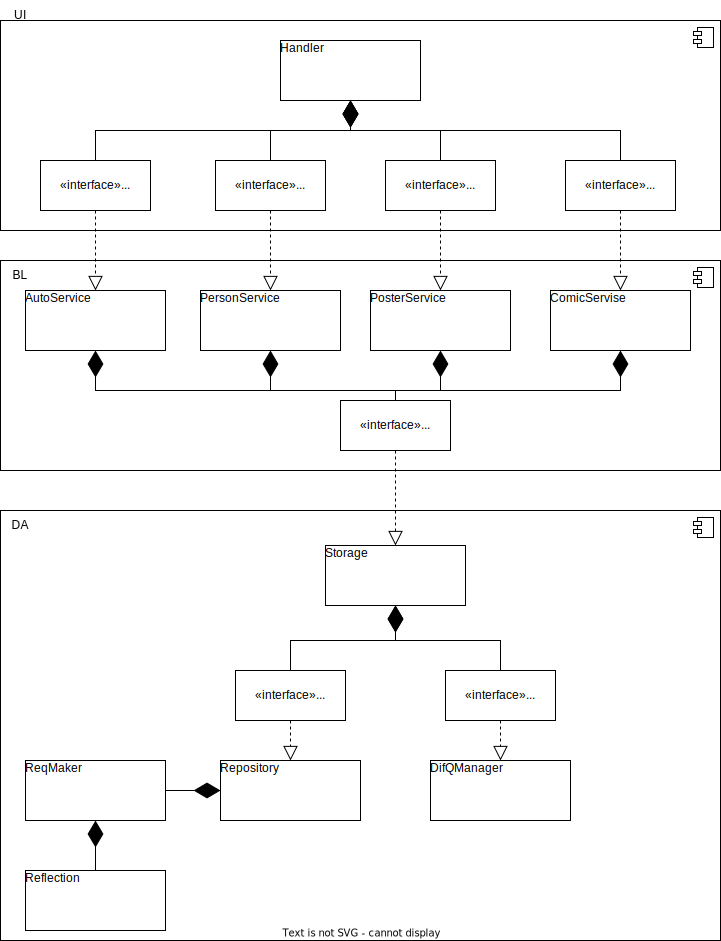

# RUSH Stand Up Club

## Цель работы
Автомотизация работы StandUp клуба.

Проект представляет из себя сайт, на котором будут размещаться описания мероприятий и их расписание. Также будет раздел с описанием комиков клуба. Это все будет доступно неавторизованному пользователю. К авторизованному пользователю добавится возможность записи на мероприятие и ее отмены, и просмотр истории мероприятий на которые он был записан. 
А админ в свою очередь сможет добавлять, удалять, изменять и просматривать мероприятия, комиков и авторизованных пользователей. 

## Краткий перечень функциональных требований

## Use-case диаграмма системы

Существует три типа роли:

- гость (guest)

- авторизованный пользователь (authUser)

- админестратор (admin)

## BPMN диаграмма основных бизнес-процессов

## Примеры описания основных пользовательских сценариев

- гость
	+ посмотреть мероприятия
		- зайти на сайт
		- 

## ER-диаграмма сущностей

## Диаграмма БД

## Компонентная диаграмма системы

## Экраны 

- Экран авторизации
- Экран регистрации
- Экран с информацией о мероприятиях для гостя/авторизованного пользователя
- Экран с информацией о мероприятиях для админестратора
- Экран с информацией о комиках для гостя/авторизованного пользователя
- Экран с информацией о комиках для админестратора
- Экран просмотра мероприятия
- Экран просмотра комика
- Экран добавления/изменения мероприятия
- Экран добавления/изменения мероприятия

[figma экраны](https://www.figma.com/file/NZxo1dFA5Af1oVXsSOYjJx/%D0%AD%D0%BA%D1%80%D0%B0%D0%BD%D1%8B?type=design&node-id=0-1&mode=design&t=iYfCQuQpIYJNW03z-0) 
